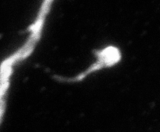
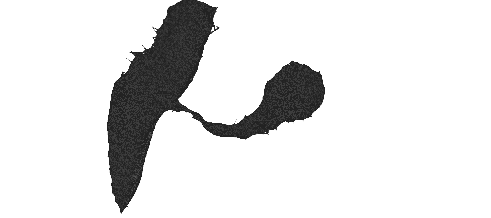

# Spine reconstruction and analysis pipeline

This project is the code used for the analysis of the paper : Distinct forms of structural plasticity of adult-born interneuron spines induced by different odor learning paradigms. Available here : https://www.biorxiv.org/content/10.1101/2023.07.20.549882v1
The reconstruction pipeline as well as the analysis pipeline was used to study dendritic spines but feel free to test it on your data. Please, if you use this code, cite us :
```
 Distinct forms of structural plasticity of adult-born interneuron spines induced by different odor learning paradigms
Aymeric Ferreira, Vlad-Stefan Constantinescu, Sarah Malvaut, Armen Saghatelyan, Simon V. Hardy
bioRxiv 2023.07.20.549882; doi: https://doi.org/10.1101/2023.07.20.549882 
```

# Table of Contents
1. [Install](#Install)
2. [Deconvolution](#Deconvolution)
3. [Segmentation](#Segmentation)
4. [3D reconstruction](#3D-reconstruction)
5. [Extraction of the spines](#Extraction-of-the-spines)
6. [Analysis of the spines](#Analysis-of-the-spines)
7. [Analysis pipeline](#Analysis-pipeline)
8. [Notes](#Notes)

# Install

This package may require the installation of the package PyImageJ for the deconvolution process. If needed, follow the instructions on the official website : https://github.com/imagej/pyimagej

 If you prefer to skip deconvolution, plan to use ImageJ directly, or have installed PyImageJ, you can install the remaining requirements via pip. For guidance on installing Python, refer to our previous project:  https://github.com/SaghatelyanLab/clusterAnalysis


```bash
pip install -r requirements.txt
```

# Deconvolution

This package allows for the deconvolution of images. We have included the FIJI version with the Iterative Deconvolve 3D plugin pre-installed. To use it, open your image in FIJI and run the plugin. Alternatively, the **deconvolve_folder** method in **deconvolution_segmentation.py** can be used, but it requires correctly binding Maven and JAVA to PyImageJ. For more information, refer to the https://py.imagej.net/en/latest/Troubleshooting.html#jgo-jgo-executablenotfound-mvn-not-found-on-path


Below are examples of images before and after deconvolution:

Image without deconvolution :



Image with deconvolution :


# Segmentation

Place your images in the **Images** folder and run deconvolution_segmentation.py. Adjust the parameters in the file as needed. The best parameters for single spine images were found to be **mu = 1**, **lambda1 = 1**, **lambda2 = 4**. For full confocal images, **mu = 1**, **lambda1 = 1**, **lambda2 = 9** yielded the best results.

Segmented image : 


# 3D reconstruction

The **3D_reconstruction.py** script reconstructs 3D images from the **Segmented** image folder, creating several meshes in the Mesh folder. The optimal **level_threshold** value depends on your image's signal-to-noise ratio and the strength of the spine neck signal. For our images, parameters between 10 and 20 provided the best results.



# Extraction of the spines

To extract the dendritic spines from the dendrite we used meshlab. You can download it here : https://www.meshlab.net/#download
The extraction is performed manually.

# Analysis of the spines

After extraction, place your spines in the **Spines** folder and run **metrics.py**. The script calculates and outputs metrics for each spine in a CSV file. These metrics include Length, Volume, Surface, Hull Volume, Hull Ratio, Average Distance, CVD, and Open Angle.
- **Length**: the length of the spine
- **Volume** : the volume of the spine
- **Surface** : the surface of the spine
- **Hull volume** : the volume of the convex hull of the spine
- **Hull ratio** : the ratio between the volume of the spine - the volume of the convex hull by the Volume of the spine
- **Average distance** : the average distance between the spine and the convex hull
- **CVD** : the coefficient of variation of the distance between the edges of the spine and the spine base center
- **Open angle** : the angle between the spine normal and the different vertices of the spine

Users can easily add metrics if needed by adding them in the function **compute_trimesh_metrics** in the file **metric.py**.

# Analysis pipeline 

The analysis pipeline is similar to our previously published work : https://github.com/SaghatelyanLab/clusterAnalysis
We added scripts (**kde.py** and **piecharts.py**) for generating Kernel Density Estimation (KDE) graphs, pie charts, and associated statistical tests.

# Workflow

Add your images in Images/ folder. The parameters of segmentation **mu**, **lambda1**, **lambda2** and **iterations** can be adjusted to increase segmentation quality. 
After defining the parameters, run :

```bash
python deconvolution_segmentation.py
```

Then, adjust the parameters **z_spacing**, **pixel_size_x** and **pixel_size_y** according to your image stack and perform the reconstruction :

```bash
python reconstruction.py
```

Then, extract your spines manually using Meshlab and place them in Spines/ folder. Finally, run :

```bash
python metrics.py
```

The metrics will be saved in a CSV file in the Spines/ folder.

After downloading the analysis pipeline, modify the **DataSetpath** in the **general_analysis_parameters.json** and perform the analysis using :

```bash
python analyse.py
```


# Notes :

- PyimageJ has specific system requirements, including the installation of conda/mamba, and it currently supports only up to Python 3.8.  For users looking to perform deconvolution tasks, an alternative approach is to utilize ImageJ with the Iterative Deconvolve 3D plugin, available here : https://imagej.net/plugins/iterative-deconvolve-3d . This plugin is compatible with versions of ImageJ up to 1.52p, a working version of FIJI is included in this repo.
- Additionally, it's important to note that the original morphsnakes.py script has compatibility issues with newer versions of numpy (specifically versions above 1.22), leading to deprecation warnings. The warning in question, VisibleDeprecationWarning, is triggered by creating an ndarray from sequences of varying lengths or shapes. Currently, to avoid these issues, it is recommended to use numpy versions below 1.23. However, we have proposed a modification to morphsnakes.py to address this warning and enhance compatibility with newer numpy versions.