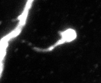

# Install

The package can requires the installation of pyimageJ for the deconvolution. In this case follow the instruction of the 
official website : https://github.com/imagej/pyimagej
If you want to skip the deconvolution part or will use directly ImageJ, or you installed pyimagej, you can install the remaining requirements with pip :
If you need help installing python you can follow the instructions of our previous project : https://github.com/SaghatelyanLab/clusterAnalysis


```bash
pip install -r requirements.txt
```

# Deconvolution

Images can be deconvolve. We included the FIJI version with Iterative Deconvolve 3D plugin already install. 
Start FIJI, open the image you want to deconvolve, and run the plugin.


You can also use the method deconvolve_folder from deconvolution_segmentation.py however you will need to correctly bind maven JAVA to pyimagej. More information is available in the official documentation : https://py.imagej.net/en/latest/Troubleshooting.html#jgo-jgo-executablenotfound-mvn-not-found-on-path

Image without deconvolution :


Image with deconvolution :



# Segmentation

Put your images in the folder Images, and run the script deconvolution_segmentation.py. You can change the parameters in the file. There is 3 parameters that can be adjusted depending on your images according to : https://scikit-image.org/docs/stable/auto_examples/segmentation/plot_chan_vese.html
We noticed that for single spine images, the best parameters for use were mu = 1, lambda1 = 1 and lambda2 = 4. For full confocal images, mu = 1, lambda1 = 1 and lambda2 = 9 were the best.

Segmented image : 


# 3D reconstruction

The script 3D_reconstruction.py will reconstruct the 3D image from the Segmented image folder. The script will create several meshes in Mesh folder. The best value for parameter for level_threshold is difficult to estimate, and will depend on the signal-to-noise ratio of your images and the strength of the signal for your spine neck. For our images, the best results were found for parameter between 10 and 20.


# Extraction of the spines

To extract the dendritic spines from the dendrite we used meshlab. You can download it here : https://www.meshlab.net/#download

# Analysis of the spines

After extraction, put your spines in the Spines folder and run the script metrics.py. The script will create a csv file with the metrics for each spine. The script will create a csv file with the metrics for each spine. The metrics are :
- Length: the length of the spine
- Volume : the volume of the spine
- Surface : the surface of the spine
- Hull volume : the volume of the convex hull of the spine
- Hull ratio : the ratio between the volume of the spine - the volume of the convex hull by the Volume of the spine
- Average distance : the average distance between the spine and the convex hull
- CVD : the coefficient of variation of the distance between the edges of the spine and the spine base center
- Open angle : the angle between the spine normal and the different vertices of the spine

Several metrics could be added to this list, and we encourage you to add them if you need them.


# Analysis pipeline 

The analysis pipeline is similar to our previously published work : https://github.com/SaghatelyanLab/clusterAnalysis
We added a script (kde.py) to generate the Kernel Density Estimation (KDE) and a script (piecharts.py) to generate the piecharts and the related statistical tests.

# Notes :

- PyimageJ have heavy requirements and ask for installation of conda/mamba and is limited to python 3.8, if you want to perform deconvolution you can also use imageJ with the Iterative Deconvolve 3D : https://imagej.net/plugins/iterative-deconvolve-3d that can be run on imageJ <= 1.52p

- The original morphsnakes.py suffers from a deprecation warning because of the changes to numpy >1.22, 
VisibleDeprecationWarning: Creating an ndarray from ragged nested sequences (which is a list-or-tuple of lists-or-tuples-or ndarrays with different lengths or shapes) is removed. morphsnakes could maybe be updated, for the moment requirements requires numpy <1.23. Note that we propose a modification of morphsnakes.py to avoid this warning.